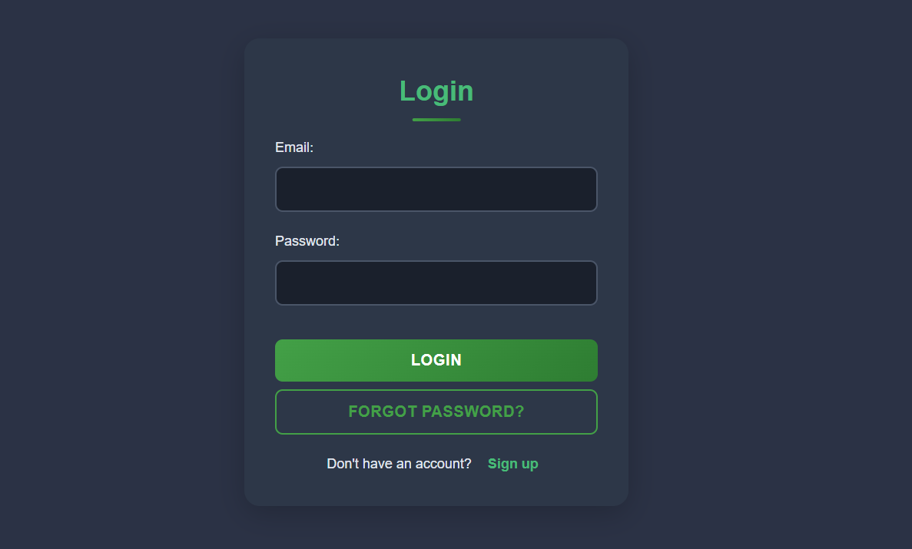
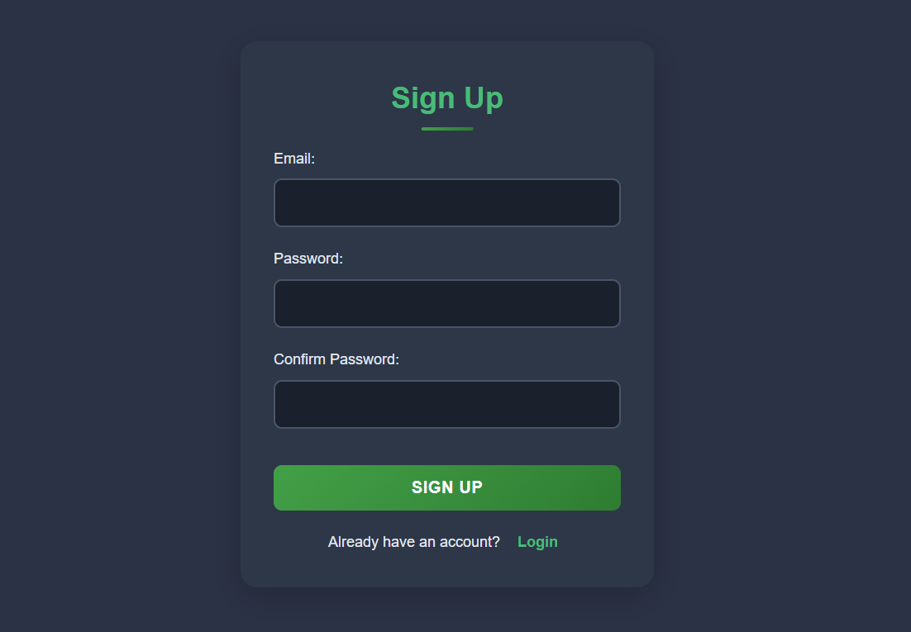
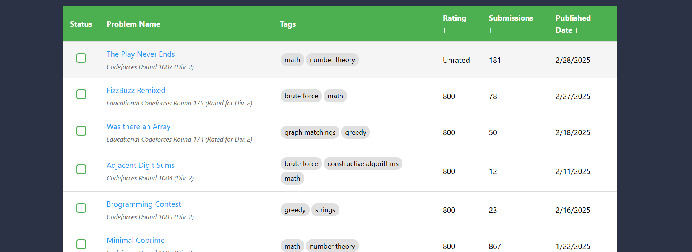
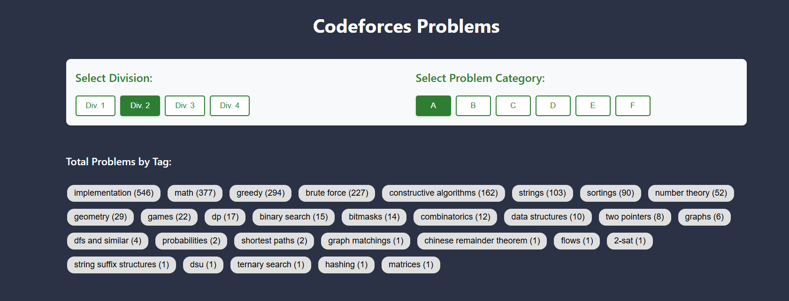
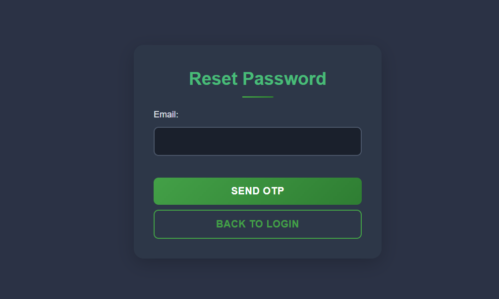

# Codeforces Problem Tracker

A full-stack web application built with React and Node.js that helps users track their Codeforces problem-solving progress.

## Screenshots

### Login Page

- User authentication with email and password
- "Forgot Password" option for password reset
- Link to register new account

### Register Page

- New user registration with email and password
- Form validation and error handling

### Problem Tracking Page



- List of Codeforces problems
- Mark/unmark problems as solved
- Track solving progress

### Password Reset Flow

- Email-based password reset
- OTP verification
- Secure password update

## Features

- **User Authentication**
  - Register with email and password
  - Login with existing credentials
  - Secure password reset with email OTP verification
  - JWT-based authentication

- **Problem Tracking**
  - Track solved Codeforces problems
  - Mark/unmark problems as solved
  - View solving progress

## Tech Stack

### Frontend
- React
- Vite
- CSS Modules
- Axios for API calls

### Backend
- Node.js
- Express.js
- MongoDB with Mongoose
- JWT for authentication
- Nodemailer for email services
- bcryptjs for password hashing

## Project Structure

```
codeforces-react/
├── client/                 # Frontend React application
│   ├── src/
│   │   ├── components/    # React components
│   │   ├── assets/       # Static assets
│   │   └── App.jsx       # Main application component
│   └── package.json
│
└── Backend/               # Backend Node.js application
    ├── models/           # MongoDB models
    ├── routes/          # API routes
    └── server.js        # Server entry point
```

## Setup Instructions

1. **Clone the repository**
   ```bash
   git clone <repository-url>
   cd Codeforces_Problems_Sheet
   ```

2. **Backend Setup**
   ```bash
   cd Backend
   npm install
   ```

   Create a `.env` file in the Backend directory with:
   ```
   MONGODB_URI=your_mongodb_connection_string
   JWT_SECRET=your_jwt_secret
   PORT=5000
   EMAIL_USER=your_gmail_address
   EMAIL_PASSWORD=your_gmail_app_password
   FRONTEND_URL=http://localhost:5173
   ```

3. **Frontend Setup**
   ```bash
   cd client
   npm install
   ```
   Create a `.env` file in the client directory with:
   ```
   VITE_API_URL=http://localhost:5000
   ```

4. **Running the Application**
   
   Backend:
   ```bash
   cd Backend
   npm start
   ```

   Frontend:
   ```bash
   cd client
   npm run dev
   ```

## Gmail Setup for Password Reset

1. Enable 2-Step Verification in your Google Account
2. Generate an App Password:
   - Go to Google Account Settings
   - Navigate to Security
   - Under "2-Step Verification", find "App passwords"
   - Generate a new app password for "Mail"
   - Use this password in your .env file

## API Endpoints

### Authentication
- `POST /api/auth/register` - Register new user
- `POST /api/auth/login` - User login
- `GET /api/auth/me` - Get user profile
- `POST /api/auth/updateSolvedProblem` - Update solved problem status
- `GET /api/auth/getSolvedProblems` - Get user's solved problems

### Password Reset
- `POST /api/forgot-password/send-otp` - Send OTP to email
- `POST /api/forgot-password/verify-otp` - Verify OTP
- `POST /api/forgot-password/reset-password` - Reset password with OTP

## Security Features

- Passwords are hashed using bcrypt
- JWT tokens for authentication
- Email verification for password reset
- OTP expiration after 2 minutes
- Secure email configuration with Gmail SMTP

## Contributing

1. Fork the repository
2. Create a feature branch
3. Commit your changes
4. Push to the branch
5. Create a Pull Request

## License

This project is licensed under the MIT License.
